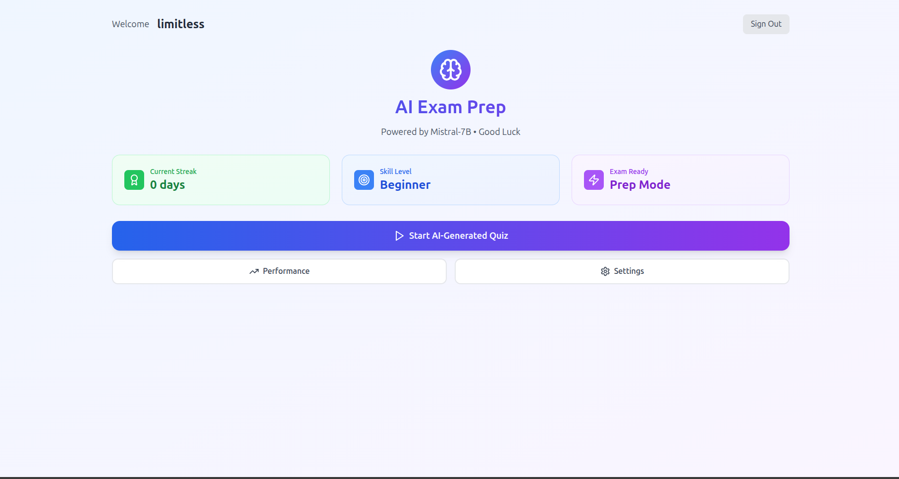
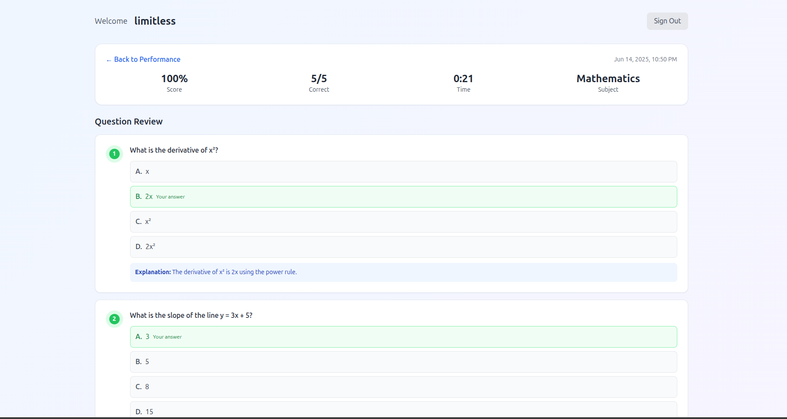
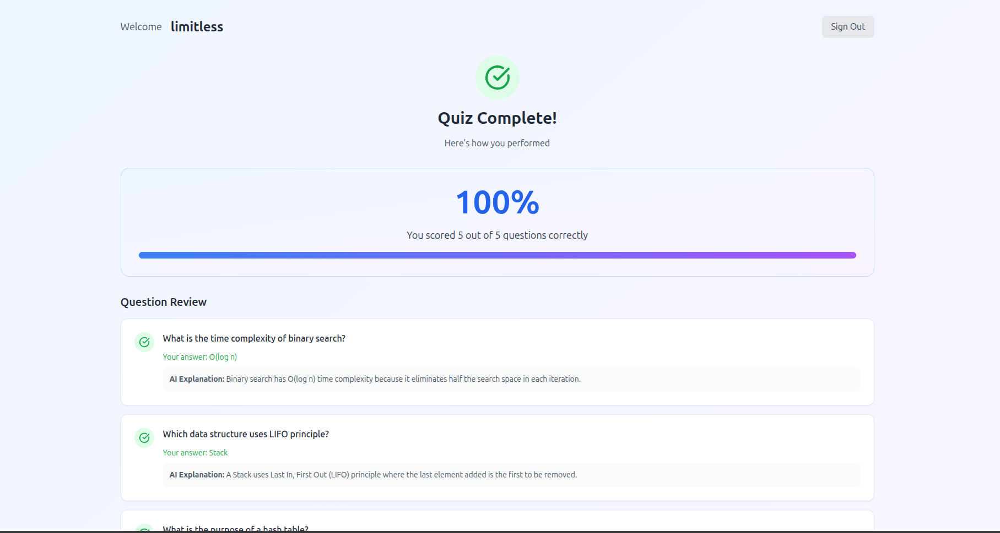
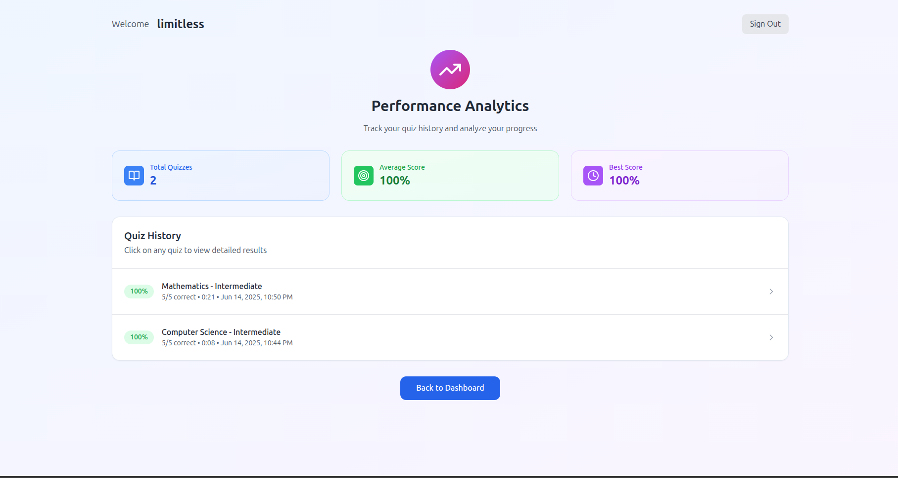

# Exam-Ace Quiz Application

Exam-Ace is an AI-powered quiz generation and performance analytics platform built using Mistral-7B, React, Supabase, and Tailwind CSS. It enables users to generate subject-specific quizzes, track progress over time, and receive intelligent feedback on their performance.

---

## Live Demo

[Access the Live Application](https://exam-ace-ai.vercel.app/)

---

## Screenshots

| Dashboard | Quiz Interface |
|-----------|----------------|
|  |  |

| Results Page | Performance Analytics |
|--------------|-----------------------|
|  |  |

| AI Explanation | Login Page |
|----------------|--------------|
|  |  |

---


---

## Features

### Core Architecture

- **Frontend:** React 18.3.1 with TypeScript, Vite for fast builds
- **Styling:** Tailwind CSS with shadcn/ui components (based on Radix UI)
- **Routing:** React Router DOM with single-page application (SPA) structure
- **State Management:** React Query and local React state
- **Backend Services:** Supabase (PostgreSQL) with real-time support
- **Authentication:** Supabase Auth with email/password and Google OAuth

---

## Authentication System

- Email/password authentication with validation
- Google OAuth for single sign-on
- Persistent sessions with automatic token refresh
- Automatic profile creation on signup
- Sign-out and session termination
- Protected routes for authenticated features

---

## AI-Powered Quiz Generation

- Utilizes Mistral-7B model in-browser using `transformers.js`
- Model downloaded progressively on first use
- Fallback question bank for instant accessibility
- Coverage of key subjects: Computer Science, Mathematics, Physics, Chemistry, Biology, History, Literature, and Business
- Difficulty levels: Beginner, Intermediate, Advanced
- Deduplication to avoid repeating previously generated questions

---

## Quiz System

- Customizable settings: subject, difficulty, number of questions (1–20), time limit (5–60 minutes)
- Interactive quiz interface with multiple choice questions
- Real-time countdown timer with auto-submit
- Answer selection with visual feedback
- Progress tracking and completion detection

---

## Results and Analytics

- Real-time scoring with accuracy and percentage metrics
- Detailed review of each question with explanations
- AI-generated explanations for each answer
- History of past quiz attempts
- Performance charts and progress graphs
- Daily streak tracking and longest streak records

---

## User Profile Management

- Editable display name
- Real-time reflection of updates across app
- Skill level computed from performance trends
- Display of current streak, quizzes completed, and level
- Data persistence via Supabase

---

## Database Schema

### `profiles` Table

| Column           | Description                                   |
|------------------|-----------------------------------------------|
| id               | User UUID                                     |
| email            | Email address                                 |
| name             | Display name                                  |
| skill_level      | Automatically calculated skill level          |
| current_streak   | Consecutive days of quiz activity             |
| longest_streak   | Longest consecutive streak                    |
| last_quiz_date   | Timestamp of most recent quiz                 |
| total_quizzes    | Total number of quizzes attempted             |
| created_at       | Record creation timestamp                     |
| updated_at       | Last update timestamp                         |

### `quiz_attempts` Table

| Column           | Description                                   |
|------------------|-----------------------------------------------|
| id               | Unique identifier for the quiz attempt        |
| user_id          | Foreign key linking to user                   |
| subject          | Subject of the quiz                           |
| difficulty       | Selected difficulty level                     |
| total_questions  | Number of questions in the quiz               |
| correct_answers  | Number of correct responses                   |
| score_percentage | Final score percentage                        |
| time_taken       | Duration taken to complete the quiz           |
| questions_data   | Serialized questions and correct answers      |
| user_answers     | User-submitted responses                      |
| completed_at     | Quiz completion timestamp                     |

- Row-Level Security ensures users can only access their own data
- Trigger-based profile creation on user signup
- Post-quiz function updates streaks and skill metrics

---

## Analytics and Monitoring

- Historical performance tracking
- Subject-wise and difficulty-wise score analysis
- Quiz completion time and accuracy reporting
- Daily streak and engagement visualization

---

## UI Structure

| Page           | Description                                  |
|----------------|----------------------------------------------|
| Dashboard      | Central hub with user data and actions       |
| Quiz Interface | Real-time multiple-choice quiz environment   |
| Results Page   | Post-quiz analysis and scoring breakdown     |
| Performance    | Charts for long-term progress visualization  |
| Settings       | User-configurable quiz preferences           |
| Auth Forms     | Sign in and sign up pages with validation    |

---

## Security and Best Practices

- JWT-based secure session handling
- HTTPS encryption and secure data transmission
- Input sanitization and validation
- Supabase Row Level Security for strict access control

---

## Performance Optimizations

- On-device Mistral inference using `transformers.js` (no external API calls)
- Model downloaded and cached locally on first use
- Lazy loading of components and deferred execution
- Optimized queries with indexed columns
- Efficient state updates via React Query

---

## Technology Stack

| Domain            | Tools and Libraries                        |
|-------------------|--------------------------------------------|
| Frontend          | React, Vite, TypeScript, Tailwind CSS      |
| UI Components     | shadcn/ui, Radix UI                        |
| Authentication    | Supabase Auth (email/password + OAuth)     |
| Backend Services  | Supabase (PostgreSQL with RLS)             |
| AI Model          | Mistral-7B via transformers.js             |
| Hosting           | Vercel with GitHub integration             |
| State Management  | React Query + React Hooks                  |

---

## Getting Started

### Prerequisites

- Node.js (>= 18.x)
- Supabase project and keys

### Installation

```bash
# Clone the repository
git clone https://github.com/your-username/eduai-quiz.git](https://github.com/limitless235/Exam-Prep-App.git
cd eduai-quiz

# Install dependencies
npm install

# Set up environment variables
cp .env.example .env
# Add your Supabase URL, anon/public keys, and other settings

# Run the development server
npm run dev
